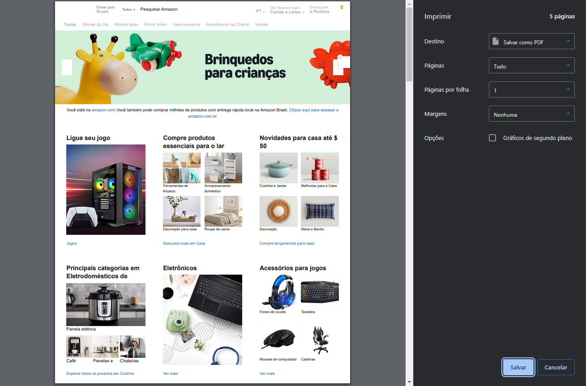
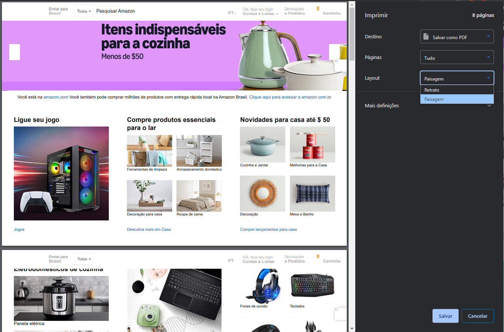

# Fix Orientation for Printing Userstyle

## Language: [English](docs/README_en.md) | [Português (Brasil)](docs/README_pt-br.md)

##### Table of Contents

1. [Description](#description)

2. [Installation](#installation)

3. [Compatibility](#compatibility)

4. [License](#license)

---

### Description

This userstyle sets the page size to automatic for printing web pages, improving compatibility with Chrome's print window when using the printer's default settings. This is especially useful for addressing issues with the absence of the "Landscape" option in Chrome's print window.

#### Before:

#### After:

**Credits**: This userstyle is based on a solution provided by [Peter Ajamian](https://support.google.com/chrome/thread/3101500?hl=en&msgid=95601075) in a Google Chrome support thread.

### Installation

1. Install the [Stylus extension](https://add0n.com/stylus.html) for Chrome, Firefox, or Edge.
2. Click [this link](https://github.com/Drigva/UserStyles/raw/refs/heads/main/fix-print-orientation/css/fix-print-orientation.user.css) to install the userstyle directly in Stylus.
3. Confirm the installation in Stylus, and the style will be applied to all web pages.
4. When printing, the page should now adjust automatically to the correct orientation.

### Compatibility

- Works with Chrome, Firefox, and Edge via the Stylus extension.
- Tested on web pages using Chrome's print dialog.
- No known conflicts with other userstyles.

### License

This project is licensed under the MIT License. See the [LICENSE](LICENSE) file for details.
