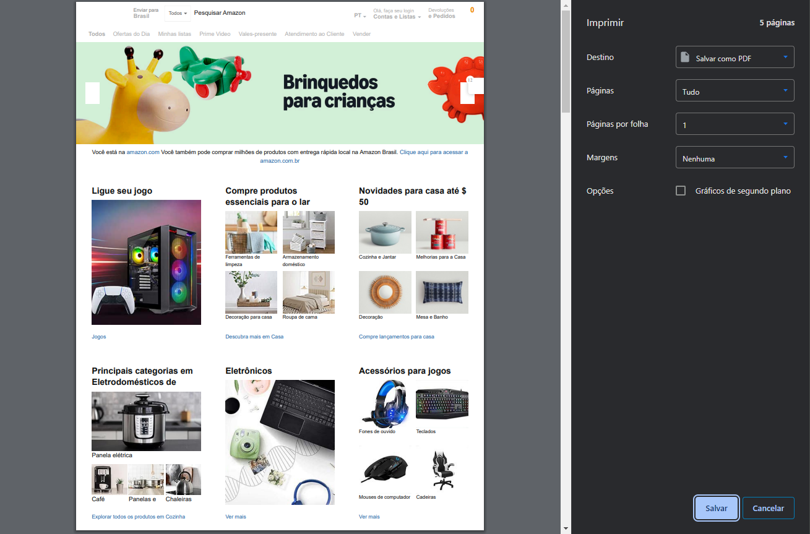
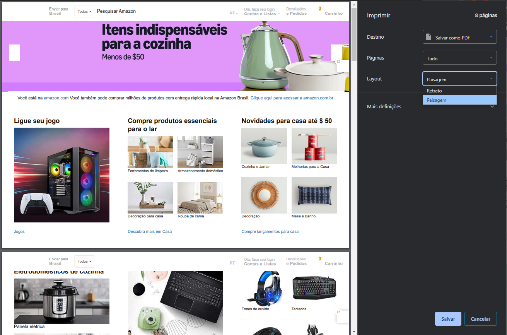

# Fix Orientation for Printing Userstyle

## Language: [English](README_en.md) | [Português (Brasil)](README_pt-br.md)

---

##### Sumário

1. [Descrição](#descrição)

2. [Instalação](#instalação)

3. [Compatibilidade](#compatibilidade)

4. [Licença](#licença)

### Descrição

Este userstyle define o tamanho da página como automático para impressão em páginas da web, melhorando a compatibilidade com a janela de impressão do Chrome ao usar as configurações padrão da impressora. Isso é especialmente útil para resolver problemas com a ausência da opção "Paisagem" na janela de impressão do Chrome.

#### Antes:

#### Depois:

**Créditos**: Este userstyle é baseado em uma solução fornecida por [Peter Ajamian](https://support.google.com/chrome/thread/3101500?hl=en&msgid=95601075) em um tópico de suporte do Google Chrome.

### Instalação

1. Instale a extensão [Stylus](https://add0n.com/stylus.html) para Chrome, Firefox ou Edge.
2. Clique [neste link](https://github.com/Drigva/UserStyles/raw/refs/heads/main/fix-print-orientation/css/fix-print-orientation.css) para instalar o userstyle diretamente no Stylus.
3. Confirme a instalação no Stylus, e o estilo será aplicado a todas as páginas da web.
4. Ao imprimir, a página agora deve se ajustar automaticamente à orientação correta.

### Compatibilidade

- Funciona com Chrome, Firefox e Edge por meio da extensão Stylus.
- Testado em páginas da web usando a janela de impressão do Chrome.
- Não há conflitos conhecidos com outros userstyles.

### Licença

Este projeto está licenciado sob a Licença MIT. Veja o arquivo [LICENSE](LICENSE) para mais detalhes.
